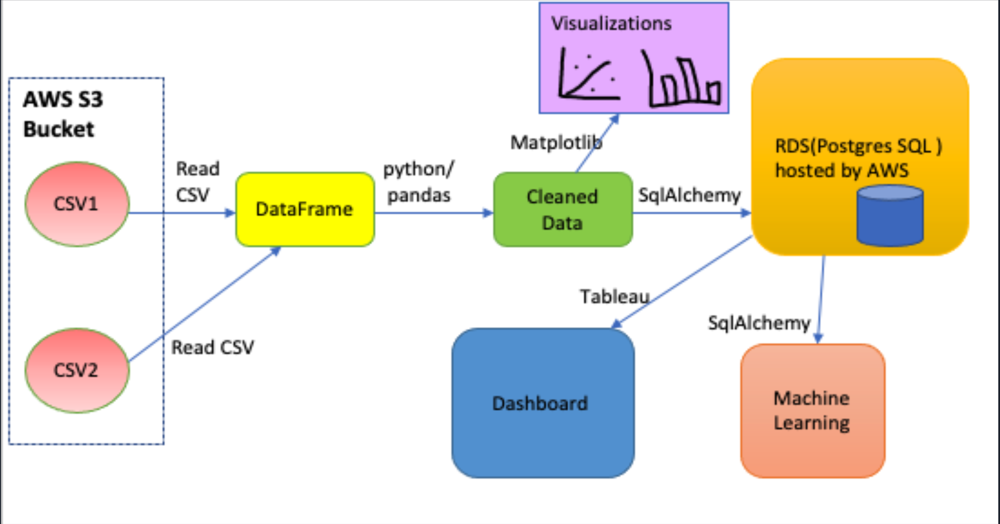

 
## COVID-19 Insights 

   

### Overview
Covid-19 caused a global pandemic so this data is  relevant to what is happening across the globe. 

The Google Slides presentation for this project can be found 
here on [Google Slides](https://docs.google.com/presentation/d/1R6NoK6VatRhL9BzGuit1nTV8Zf-JTV8qRfew4igPopU/edit#slide=id.gc12a178845_0_155).

The interactive dashboard can be found here. 
[Dashboard](https://public.tableau.com/profile/arshi.singh#!/vizhome/Final_Dashboard_Covid_19/StoryofCovid?publish=yes)

### Reason why we selected the topic 
It's relavent to what is happening currently across the globe. The trends may provide insight on how this pandemic will play out moving forward in 2021.

### Description of the source of data
Two datasets are linked below:

- [Source 1] (https://data.cdc.gov/Case-Surveillance/COVID-19-Case-Surveillance-Public-Use-Data/vbim-akqf)
- [Source 2] (https://www.visualcapitalist.com/visualizing-u-s-population-by-race/#:~:text=As%20of%202019%2C%20here%20is,Black%3A%2012.2%25)

Source 1 is surveillance  data provided by the CDC. While source 2 is data on population distrbution by ethnic group.   
 

### Insights we hope to derive with the data

1.   Correlation between ethnic groups and covid related deaths. 
2. Distribution of hospitalization by age group.
3.  Use ML model to predict the probability of a person dying from covid based on sex, age, ethnicity, underlying medical conidtion, hospitlization and  intensive care unit.

# Data Analysis

### Data Processing

- Use Jupyter Notebook, Pandas and Python to load in the data of covid case surveillance data from the CDC government website
- Perform data clean up by dropping the nan and missing values
- Create data frames
- Use data frames to plot graphs and pie charts and show the appropriate visualisations we want to demonstrate 
- Create a database using AWS
- Run our data through Postgress and connect the server to RDS on AWS using the endpoint URL
- Take the new dataset created through Postgress and export it into a csv file, and feed it into a machine learning model
- Use Tabelau to create our dashboard and make a powerpoint presentation

### DataBase 
After merging the data via inner join on ethnicity. The new merged dataset is stored in PostgreSQL and hosted by AWS. The schema and examples of the tables used in PostgreSQL are inclued below.

 SCHEMA:
 
 
 PostgreSQL:
 

### Machine Learning

### 1. Description of preliminary feature engineering and preliminary feature selection, including decision making process
- Since we are predicting a binary outcome patient died or not, we dropped the date columns as they had no value to the machine learning model.
- Dropped Missing values in every column as they had no value.
- Used LabelEncoder to enocode the categorical values into numerical features to use for the Machine Learning models.

### 2. How data was split into training and testing sets

- We will be using the 80/20 rule.

### 3. Explanation of model choice, including limitation and benefits 

#### Logistic Regression
 - Using logistics regression since we are trying to predict a binary outcome, 0 (patient lived) or 1 (patient died).
 - Using features such as sex,	age_group,	race_ethnicity, hosp_yn, icu_yn, medcon
 - A benefit is this model is easy to implement.
 - A limitation is multiple features are needed for a model. 
#### Random Forest Classifier
 - Reliable ensemble maching learning model that uses mutiple Decisio Trees.
 - Random Forest Classifier to see if we can get a different accuracy score.
 - Once pro is using the feature importance to see the importance of the features selected.
 - Another benefit is it is suitable for large datasets.
 - A random forest is prone to overfitting. 
 - Our model can be biased towad variables with more levels.
 
##### Feature Importance 

- One of the benefits from using a random forest is using the above function to easily visualize our 
- Above shows the best features fo the Random Forest. 
- If we wanted to make our machine learning model better we could drop the less important feature.

#### Decision Tree Model
 - Decision Tree model was used from segment 3 to segment 3 to see the difference between a Random Forest and Decision Tree.
 - Simple machine learning module, clear representation.
 - Like Random Forest model is prone to Overfitting.
 - Since it only uses one root node and then splits after that, it wont be as beneficial as a Random Forest.

### Description of accuracy score 

- As seen from the image below our best model was Random Forest.

- As see from our Classification Reports all of our models scored better when predicting a patient to live as our precision,recall and f-1 score was around 90% percent but we had lower scores on the prediction of a patient dying.

### Description of the communication protocols
- zoom
- slack

